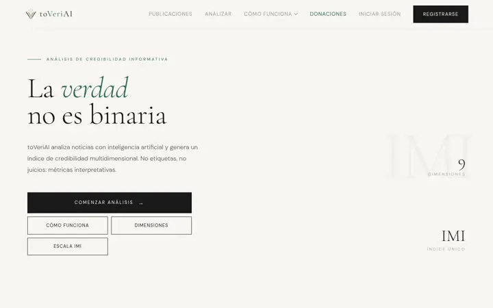

  

<h1 align="center">Galivelop</h1>

  <strong>Taller independiente de software</strong> 
  Hacemos reales los proyectos que parecen imposibles.

  <a href="https://zeldris.github.io/Portal-Galivelop/"><strong>Visitar el portal →</strong></a>
  &nbsp;·&nbsp;
  <a href="https://discord.gg/8vyjW3VrN">Discord</a>
  &nbsp;·&nbsp;
  <a href="mailto:cordproinf@gmail.com">cordproinf@gmail.com</a>

  <a href="#galego">Galego</a> · <a href="#english">English</a>

---

## Qué es Galivelop

Galivelop es un taller donde creamos, investigamos y aprendemos construyendo software ambicioso:
desde un mundo de fantasía que vive por su cuenta hasta una herramienta que mide la credibilidad de
las noticias.

No es un escaparate. No nos mueve el beneficio económico, sino crecer y llevar a término proyectos
complejos. Por eso el portal no vende: enseña cada proyecto tal y como está, con sus avances y sus
pendientes, y deja la puerta abierta a quien quiera saber más o sumarse.

El nombre une **Gali**cia, de donde venimos, y **Develop**, lo que hacemos.

## Proyectos

| | Proyecto | Estado | |
|---|---|---|---|
|  | **Tarkor** RPG narrativo por texto con una IA local como directora de juego. Las facciones, la economía y la fauna evolucionan solas mientras levantas tu propio reino. | 🟡 En desarrollo (alpha) · abierto a colaboración | [Ver proyecto](https://zeldris.github.io/Portal-Galivelop/proyectos/tarkor) |
|  | **toVeriAI** Plataforma web que analiza noticias, enlaces y capturas con IA y devuelve un índice de credibilidad de 0 a 100 que explica qué falla y dónde. | 🟢 Publicado en [toveriai.com](https://www.toveriai.com) · proyecto privado | [Ver proyecto](https://zeldris.github.io/Portal-Galivelop/proyectos/toveriai) |

Cada proyecto tiene su página en el portal: qué es, cómo funciona, galería, ficha técnica, hoja de
ruta y lo que estamos aprendiendo con él.

## Líneas de trabajo

- **IA local y responsable**: modelos que funcionan en el equipo de cada persona, sin cuentas ni
  costes por uso.
- **Mundos que viven solos**: facciones, economía y ecosistemas simulados que avanzan aunque nadie
  mire.
- **Información verificable**: métricas que explican por qué un contenido merece más o menos
  confianza, en lugar de dictar veredictos.
- **Del prototipo al producto**: interfaz, servidor, datos, pruebas y despliegue.

## Cómo trabajamos

1. **Elegimos problemas que importan.** Proyectos que aportan imaginación o atacan un problema real.
2. **Trabajamos en el límite de lo que sabemos.** Cada proyecto nos obliga a aprender algo nuevo.
3. **Enseñamos el proceso, no solo el resultado.** Estado real, hojas de ruta y decisiones explicadas.
4. **Aprendemos con generosidad.** Compartimos lo que sabemos y aprendemos de quien llega.

## Participa

Galivelop crece con las personas que se suman. No pedimos experiencia previa: pedimos ganas de
construir, de aprender y de hacerlo en equipo.

- **Únete al taller** y colabora en un proyecto abierto o aprende construyendo algo real:
  [formulario](https://zeldris.github.io/Portal-Galivelop/participa/unirse).
- **Propón un proyecto** que parezca demasiado grande para hacerlo en solitario:
  [formulario](https://zeldris.github.io/Portal-Galivelop/participa/proponer).
- **Entra en la comunidad** en [Discord](https://discord.gg/8vyjW3VrN) o escríbenos a
  [cordproinf@gmail.com](mailto:cordproinf@gmail.com).

## Equipo

- **Álvaro García Graña**: fundador de Galivelop, desarrollo full stack.
  [LinkedIn](https://www.linkedin.com/in/%C3%A1lvaro-garc%C3%ADa-gra%C3%B1a-b4538117b)
- **Raquel C.**: fundadora de toVeriAI.
  [LinkedIn](https://www.linkedin.com/in/raquel-comesa%C3%B1a-carrera-1646ba195)

Quien se suma al taller pasa a formar parte del [equipo](https://zeldris.github.io/Portal-Galivelop/equipo).

---

## Galego

**Galivelop é un obradoiro independente de software.** Creamos, investigamos e aprendemos construíndo
software ambicioso, dende un mundo de fantasía que vive pola súa conta ata unha ferramenta que mide
a credibilidade das novas. O portal non vende: amosa cada proxecto tal e como está e deixa a porta
aberta a quen queira participar. [Visitar o portal →](https://zeldris.github.io/Portal-Galivelop/)

## English

**Galivelop is an independent software workshop.** We create, research and learn by building
ambitious software, from a fantasy world that lives on its own to a tool that measures the
credibility of the news. The portal does not sell: it shows each project as it is and keeps the door
open to anyone who wants to take part. [Visit the portal →](https://zeldris.github.io/Portal-Galivelop/)

---

Este repositorio contiene el código del portal. Para desarrollarlo o añadir proyectos, consulta
la [guía técnica](docs/desarrollo.md). © Galivelop. Todos los derechos reservados.
