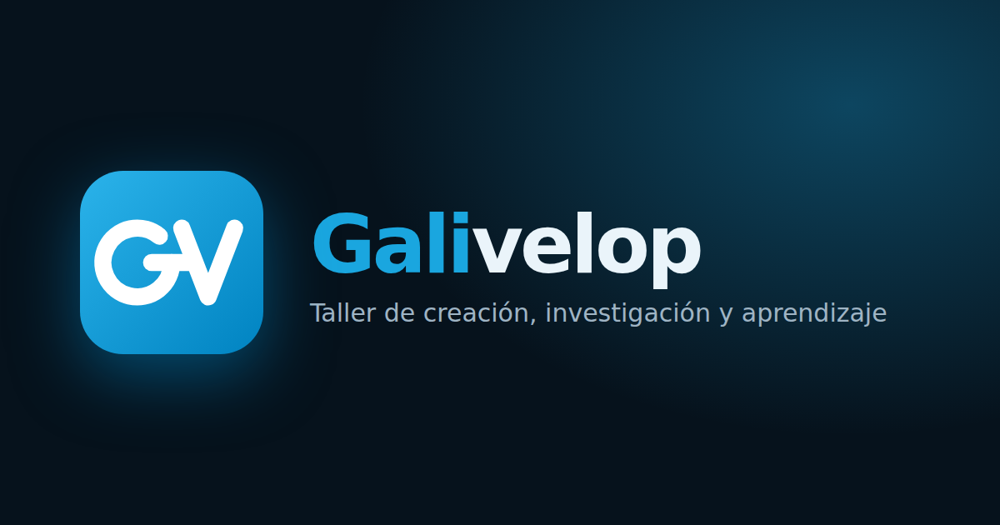

# Galivelop

**Galicia + Develop.** Portal público de la marca Galivelop: todos nuestros desarrollos, publicados
y en marcha, en un solo sitio.

Se publica con GitHub Pages en **https://zeldris.github.io/Portal-Galivelop/**.



## Qué hay

- **Portada:** presentación de la marca, proyectos con filtro por estado (publicado, en desarrollo,
  en diseño), «Qué es Galivelop» y contacto.
- **Ficha de cada proyecto** (`/proyectos/<slug>`): cabecera con estado y enlace público, cifras,
  galería con vista a pantalla completa y secciones plegables: descripción, características, ficha
  técnica, estado y hoja de ruta, novedades, decisiones de diseño y equipo.
- **Idiomas:** castellano, gallego e inglés (detecta el del navegador y recuerda la elección).
- **Tema** claro y oscuro.

El código de los proyectos no se enlaza: el portal describe cada uno y lleva solo a su versión
pública (web, descarga…) cuando la hay.

## Marca

- Logo: monograma **GD** en `public/marca/gd-logo.svg` (también como componente en
  `src/components/Logo.tsx`). La G y la D comparten el trazo horizontal.
- Colores: el azul celeste y el blanco de la bandera gallega, sin su composición:
  `#1AA6DF` (celeste), `#0083C1` (celeste intenso), `#FFFFFF`.
- Tipografías: Sora (títulos) e Inter (texto), servidas desde el propio sitio.
- `node tools/generar-marca.mjs` regenera `gd-logo-512.png` y la imagen para redes
  (`galivelop-social.png`) a partir del SVG (instrucciones en el propio archivo).

## Añadir o actualizar un proyecto

1. Crea `src/data/proyectos/<slug>.json`. Lo más rápido es copiar uno existente
   ([`tarkor.json`](src/data/proyectos/tarkor.json) o [`toveriai.json`](src/data/proyectos/toveriai.json)).
   El formato está descrito en [`src/data/tipos.ts`](src/data/tipos.ts).
2. Pon sus imágenes en `public/proyectos/<slug>/`, en WebP: cada imagen con su versión grande
   (unos 1600 px de ancho) y una `-mini` (unos 720 px) para miniaturas y tarjetas.
3. Todo texto visible va en los tres idiomas: `{ "es": "…", "gl": "…", "en": "…" }`.
4. Detalles útiles:
   - `estado`: `publicado`, `desarrollo` o `diseno`.
   - `cabecera`: `"captura"` si la portada es una captura de web o app (se enmarca en una ventana);
     sin el campo, la portada se usa de fondo.
   - `hitos[].estado`: `hecho`, `curso` o `pendiente`. El porcentaje de avance sale de ahí.
   - `caracteristicas[].icono`: uno de los nombres de [`src/components/Icono.tsx`](src/components/Icono.tsx).
   - Las secciones que dejes vacías (`[]`) no se muestran.
5. `npm run check`: los tests avisan si falta un texto en algún idioma, una imagen o un icono.

No hay que tocar código: cualquier `.json` de esa carpeta aparece solo en la portada.

## Desarrollo

```bash
npm install
npm run dev      # http://localhost:5173/Portal-Galivelop/
npm run check    # tipos + tests
npm run build    # genera dist/ (con 404.html para las rutas en GitHub Pages)
```

React 19 + Vite + TypeScript, React Router y lucide para los iconos. Sin backend: todo es estático.

## Publicación

Cada push a `main` ejecuta [`.github/workflows/pages.yml`](.github/workflows/pages.yml): comprueba,
construye y publica en GitHub Pages. Hace falta, una sola vez, ir a **Settings → Pages → Build and
deployment → Source** y elegir **GitHub Actions**.

Con un dominio propio, construir con `BASE_PATH=/` (ver [`vite.config.ts`](vite.config.ts)) y añadir
el dominio en Settings → Pages.

© Galivelop. Todos los derechos reservados.
